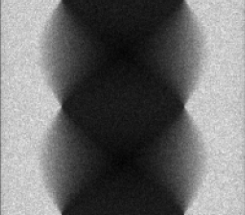

# README

This README provides an overview of X-ray Computed Tomography (CT), reconstruction and [opengate](https://github.com/OpenGATE/opengate).

Milestone 1, 2024.09.09 - 11.24.

## Contents

- [Contents](#contents)
- [X-ray Computed Tomography (CT)](#x-ray-computed-tomography-ct)
  - [Absorption Contrast Imaging](#absorption-contrast-imaging)
  - [X-ray CT Geometries](#x-ray-ct-geometries)
  - [General Components](#general-components)
- [Reconstruction](#reconstruction)
  - [Projections](#projections)
  - [Radon Transformation](#radon-transformation)
  - [Inverse Radon Transformation](#inverse-radon-transformation)
- [opengate](#opengate)
  - [Run and Timing](#run-and-timing)
  - [Actors](#actors)
- [References](#references)

## X-ray Computed Tomography (CT)

X-ray Computed Tomography (CT) is a non-destructive imaging technique used to visualize the internal density distribution of an object in either 2D cross-sections or a 3D volumetric representation.

### Absorption Contrast Imaging

Absorption contrast imaging observes differences in X-ray absorption within the object, due to its properties (eg. density), to generate contrast in the images.

### X-ray CT Source Geometries

| Type               | Description                                                 |
|--------------------|-------------------------------------------------------------|
| Parallel Beam      | X-rays are collimated into parallel beams.                  |
| Fan Beam           | X-rays diverge in a fan shape within a single plane.        |
| Cone Beam          | X-rays diverge in a cone shape, covering a volumetric area. |

### General components

| Name               | Description                                                |
|--------------------|------------------------------------------------------------|
| Source             | Emits X-ray beams towards the phantom.                     |
| Phantom            | The object being imaged.                                   |
| Detector           | Captures the X-rays after passing through the object.      |

In a typical CT system, the X-ray source and detector rotate around the phantom. This rotation allows for the collection of projections from multiple angles, which are essential for accurate image reconstruction.

## Reconstruction

Reconstruction is the mathematical process of converting 2D projections collected from multiple angles into images that represent the internal structure of the object. It estimates the distribution of X-ray attenuation coefficients within the object.

### Projections

A projection is a 2D image that represents the attenuation of X-rays as they pass through the object at a specific angle.

### Reconstruction Algorithms

- Algorithms:
  - Filtered Back-Projection
  - Iterative Reconstruction
  - Deep Learning Techniques

- Steps in Reconstruction:
  1. Data Collection: Acquire 2D projections at various angles around the object.
  2. Image Reconstruction: Apply algorithms to reconstruct the internal structure from these projections.
  3. Output Generation: Store the reconstructed images for visualization and analysis.

### Radon Transformation

The Radon Transformation is a mathematical tool that relates the internal structure of an object to the projections obtained from different angles.

The Radon transform data is often called a sinogram because the Radon transform of an off-center point source is a sinusoid.

#### Sinogram

A sinogram is a visual representation of the projection data collected during a CT scan. It is formed by stacking all the projections obtained at different angles, creating a 2D image where one axis represents the detector position and the other axis represents the projection angle. The sinogram illustrates how the projections vary with rotation angle and serves as the raw data input for reconstruction algorithms.

Example of a cube's sinogram via parallel beam CT:



### Inverse Radon Transformation

Reconstructs the original 2D image (slice) from the sinogram.

- The sinogram is transposed to align properly for reconstruction.

Example of the cube and its reconstructed cross section:


## opengate

### [Run and timing](https://opengate-python.readthedocs.io/en/master/user_guide/user_guide_reference_simulation.html#run-and-timing)

The simulation can be split into several runs, each with a given time duration. This is used for example for simulations with a dynamic geometry, e.g. a rotating gantry or a breathing patient. Gaps between the intervals are allowed. 

By default, the simulation has only one run with a duration of 1 second:
```python
sim.run_timing_intervals = [[0, 1.0 * sec]]
```

#### Multiple runs

Splitting a simulation into multiple runs is faster than executing a simulation multiple times.

Let's define 3 runs with a gap from 1.0 to 1.5 seconds:
```python
sim.run_timing_intervals = [
    [0, 0.5 * sec],         # 1st run
    [0.5 * sec, 1.0 * sec], # 2nd run
    [1.5 * sec, 2.5 * sec], # 3rd run
]
```

### Actors

#### [`DigitizerHitsCollectionActor`](https://opengate-python.readthedocs.io/en/master/user_guide/user_guide_reference_actors.html#digitizerhitscollectionactor)

The DigitizerHitsCollectionActor collects hits occurring in a given volume (or its daughter volumes). Every time a step occurs in the volume, a list of attributes is recorded. The list of attributes is defined by the user:
```python
hc = sim.add_actor('DigitizerHitsCollectionActor', 'Hits')
hc.attached_to = ['crystal1', 'crystal2']
hc.output_filename = 'test_hits.root'
hc.attributes = ['TotalEnergyDeposit', 'KineticEnergy', 'PostPosition',
                 'CreatorProcess', 'GlobalTime', 'VolumeName', 'RunID', 'ThreadID', 'TrackID']
```

#### [`DigitizerProjectionActor`](https://opengate-python.readthedocs.io/en/master/user_guide/user_guide_reference_actors.html#opengate.actors.digitizers.DigitizerProjectionActor)

This actor takes as input HitsCollections and performed binning in 2D images. If there are several HitsCollection as input, the slices will correspond to each HC. If there are several runs, images will also be slice-stacked.

#### [`FluenceActor`](https://opengate-python.readthedocs.io/en/master/user_guide/user_guide_reference_actors.html#fluenceactor)

This actor scores the particle fluence on a voxel grid, essentially by counting the number of particles passing through each voxel. The FluenceActor will be extended in the future with features to handle scattered radiation, e.g. in cone beam CT imaging.

### References

- [opengate](https://github.com/OpenGATE/opengate) and its [documentation](https://opengate-python.readthedocs.io/en/master/)
- [CT Reconstruction](https://rigaku.com/products/imaging-ndt/x-ray-ct/learning/blog/how-does-ct-reconstruction-work)
