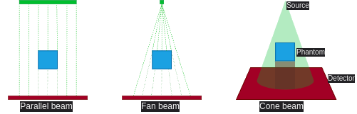
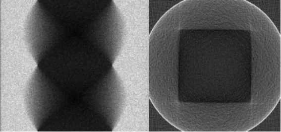

# README

This README provides an overview of X-ray Computed Tomography (CT), reconstruction and [opengate](https://github.com/OpenGATE/opengate).

Milestone 1, 2024.09.09 - 11.24.

## Contents

- [Contents](#contents)
- [X-ray Computed Tomography (CT)](#x-ray-computed-tomography-ct)
    - [Absorption Contrast Imaging](#absorption-contrast-imaging)
    - [X-ray CT Geometries](#x-ray-ct-geometries)
    - [General Components](#general-components)
- [Reconstruction](#reconstruction)
    - [Filtered Back Projection (FBP)](#filtered-back-projection-fbp)
- [opengate](#opengate)
    - [Run and Timing](#run-and-timing)
    - [Actors](#actors)
- [References](#references)

## X-ray Computed Tomography (CT)

X-ray CT is a non-destructive imaging technique used to visualize the internal density distribution of an object in either 2D cross-sections or a 3D volumetric representation.

### Absorption Contrast Imaging

Absorption contrast imaging observes differences in X-ray absorption within the object, due to its properties (eg. density), to generate contrast in the images.

### X-ray CT Source Geometries

| Type               | Description                                                 |
|--------------------|-------------------------------------------------------------|
| Parallel Beam      | X-rays are collimated into parallel beams.                  |
| Fan Beam           | X-rays diverge in a fan shape within a single plane.        |
| Cone Beam          | X-rays diverge in a cone shape, covering a volumetric area. |

### General components

| Name               | Description                                                 |
|--------------------|-------------------------------------------------------------|
| Source             | Emits X-ray beams towards the phantom.                      |
| Phantom            | The object being imaged.                                    |
| Detector           | Captures the X-rays after passing through the object.       |

### X-ray CT overview



In a typical CT system, the X-ray source and detector rotate around the phantom. This rotation allows for the collection of projections from multiple angles, which are essential for accurate image reconstruction.

## Reconstruction

Reconstruction in CT is the process of creating images of an object's internal structure from multiple X-ray images taken at different angles.

A projection is a 2D image that shows the attenuation of X-rays as they pass through the object at a specific angle.

### Filtered Back Projection (FBP)

FBP is a reconstruction technique used in CT to reconstruct a 2D image of an object's internal structure from a series of 1D projections taken at different angles.

1. **Radon Transform**:
    - Generates data representing the sum of absorption along each X-ray path.
    - Outputs a **sinogram**:
        - All projections are stacked together.
        - Displays how the projections change with each angle.
        - One axis represents the angle, the other the detector position.
2. **Filtering**:
    - Applies filters: Ram-Lak, Shepp-Logan, ramp, ...
    - Emphasizes edges and fine details, making the reconstruction sharper.
3. **Back Projection** (Inverse Radon Transform):
    - The filtered projections are **back-projected** over an image along their angles.  
    - By combining all back-projected images, the original image is approximated.

#### Example of a cube's sinogram and reconstructed cross section using Back Projection



## opengate

### [Run and timing](https://opengate-python.readthedocs.io/en/master/user_guide/user_guide_reference_simulation.html#run-and-timing)

The simulation can be split into several runs, each with a given time duration. This is used for example for simulations with a dynamic geometry, e.g. a rotating gantry or a breathing patient. Gaps between the intervals are allowed. 

By default, the simulation has only one run with a duration of 1 second:
```python
sim.run_timing_intervals = [[0, 1.0 * sec]]
```

#### Multiple Runs

Splitting a simulation into multiple runs is faster than executing a simulation multiple times.

Let's define 3 runs with a gap from 1.0 to 1.5 seconds:
```python
sim.run_timing_intervals = [
    [0, 0.5 * sec],         # 1st run
    [0.5 * sec, 1.0 * sec], # 2nd run
    [1.5 * sec, 2.5 * sec], # 3rd run
]
```

### Actors

| Algorithm | Actors                                                         |
|-----------|----------------------------------------------------------------|
| FBP       | `DigitizerHitsCollectionActor`, `DigitizerProjectionActor`     |
| CBCT (?)  | `FluenceActor`                                                 |
|           |                                                                |

- [`DigitizerHitsCollectionActor`](https://opengate-python.readthedocs.io/en/master/user_guide/user_guide_reference_actors.html#digitizerhitscollectionactor)
- [`DigitizerProjectionActor`](https://opengate-python.readthedocs.io/en/master/user_guide/user_guide_reference_actors.html#opengate.actors.digitizers.DigitizerProjectionActor)
- [`FluenceActor`](https://opengate-python.readthedocs.io/en/master/user_guide/user_guide_reference_actors.html#fluenceactor)

### References

- [opengate](https://github.com/OpenGATE/opengate) and its [documentation](https://opengate-python.readthedocs.io/en/master/)
- [CT Reconstruction](https://rigaku.com/products/imaging-ndt/x-ray-ct/learning/blog/how-does-ct-reconstruction-work)
