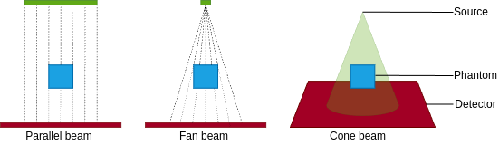

# README

This README provides an overview of X-ray Computed Tomography (CT), reconstruction and [opengate](https://github.com/OpenGATE/opengate).

Milestone 1, 2024.09.09 - 11.24.

## Contents

- [Contents](#contents)
- [X-ray Computed Tomography (CT)](#x-ray-computed-tomography-ct)
  - [Absorption Contrast Imaging](#absorption-contrast-imaging)
  - [X-ray CT Geometries](#x-ray-ct-geometries)
  - [General Components](#general-components)
- [Reconstruction](#reconstruction)
  - [Projections](#projections)
  - [Filtered Back Projection (FBP)](#filtered-back-projection-fbp)
    - [Radon Transform](#radon-transform)
    - [Sinogram](#sinogram)
    - [Filtering](#filtering)
    - [Back Projection (Inverse Radon Transform)](#back-projection-inverse-radon-transform)
- [opengate](#opengate)
  - [Run and Timing](#run-and-timing)
  - [Actors](#actors)
- [References](#references)

## X-ray Computed Tomography (CT)

X-ray CT is a non-destructive imaging technique used to visualize the internal density distribution of an object in either 2D cross-sections or a 3D volumetric representation.

### Absorption Contrast Imaging

Absorption contrast imaging observes differences in X-ray absorption within the object, due to its properties (eg. density), to generate contrast in the images.

### X-ray CT Source Geometries

| Type               | Description                                                 |
|--------------------|-------------------------------------------------------------|
| Parallel Beam      | X-rays are collimated into parallel beams.                  |
| Fan Beam           | X-rays diverge in a fan shape within a single plane.        |
| Cone Beam          | X-rays diverge in a cone shape, covering a volumetric area. |



### General components

| Name               | Description                                                |
|--------------------|------------------------------------------------------------|
| Source             | Emits X-ray beams towards the phantom.                     |
| Phantom            | The object being imaged.                                   |
| Detector           | Captures the X-rays after passing through the object.      |

In a typical CT system, the X-ray source and detector rotate around the phantom. This rotation allows for the collection of projections from multiple angles, which are essential for accurate image reconstruction.

## Reconstruction

Reconstruction is the mathematical process of converting 2D projections collected from multiple angles into images that represent the internal structure of the object. It estimates the distribution of X-ray attenuation coefficients within the object.

### Projections

A projection is a 2D image that represents the attenuation of X-rays as they pass through the object at a specific angle. Each projection is essentially a line integral of the object's internal structure, capturing how much X-ray radiation is absorbed or scattered at each point in the object along that particular path.

### Filtered Back Projection (FBP)

FBP is a reconstruction technique used in CT that combines the Radon Transform, filtering, and back projection to reconstruct an image from its projections.


#### Radon Transform

The Radon Transform is a mathematical tool that relates the internal structure of an object to the projections obtained from different angles. Its output is a sinogram.

#### Sinogram

A sinogram is a visual representation of the projection data collected during a CT scan. It is formed by stacking all the projections obtained at different angles. On a sinogram, the horizontal axis represents the projection angle, while the vertical axis represents the detector position (or radial distance). Each line in the sinogram corresponds to a projection at a particular angle.

#### Filtering

The projections are filtered to correct for the blurring effects that occur during the inverse Radon Transform.

#### Back Projection (Inverse Radon Transform)

After filtering, the back projection step takes each projection, which represents a "shadow" of the object from a specific angle, and smears it back over the image grid along the corresponding angle. This process is repeated for each projection angle, resulting in an image that approximates the original object’s internal structure.

#### Example of a cube's sinogram and reconstructed cross section without filtering


## opengate

### [Run and timing](https://opengate-python.readthedocs.io/en/master/user_guide/user_guide_reference_simulation.html#run-and-timing)

The simulation can be split into several runs, each with a given time duration. This is used for example for simulations with a dynamic geometry, e.g. a rotating gantry or a breathing patient. Gaps between the intervals are allowed. 

By default, the simulation has only one run with a duration of 1 second:
```python
sim.run_timing_intervals = [[0, 1.0 * sec]]
```

#### Multiple Runs

Splitting a simulation into multiple runs is faster than executing a simulation multiple times.

Let's define 3 runs with a gap from 1.0 to 1.5 seconds:
```python
sim.run_timing_intervals = [
    [0, 0.5 * sec],         # 1st run
    [0.5 * sec, 1.0 * sec], # 2nd run
    [1.5 * sec, 2.5 * sec], # 3rd run
]
```

### Actors

| Algorithm | Actors                                                         |
|-----------|----------------------------------------------------------------|
| FBP       | `DigitizerHitsCollectionActor`, `DigitizerProjectionActor`     |
| CBCT (?)  | `FluenceActor`                                                 |
|           |                                                                |

- [`DigitizerHitsCollectionActor`](https://opengate-python.readthedocs.io/en/master/user_guide/user_guide_reference_actors.html#digitizerhitscollectionactor)
- [`DigitizerProjectionActor`](https://opengate-python.readthedocs.io/en/master/user_guide/user_guide_reference_actors.html#opengate.actors.digitizers.DigitizerProjectionActor)
- [`FluenceActor`](https://opengate-python.readthedocs.io/en/master/user_guide/user_guide_reference_actors.html#fluenceactor)

### References

- [opengate](https://github.com/OpenGATE/opengate) and its [documentation](https://opengate-python.readthedocs.io/en/master/)
- [CT Reconstruction](https://rigaku.com/products/imaging-ndt/x-ray-ct/learning/blog/how-does-ct-reconstruction-work)
